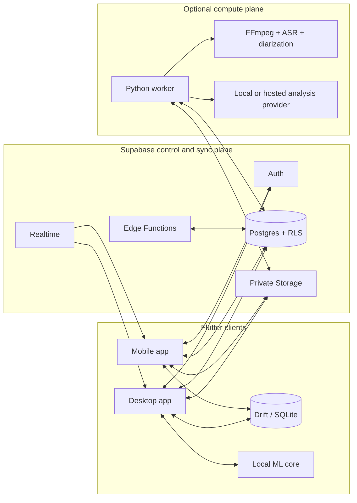

# TranscribeChats Product and Technical Implementation Specification

| Field | Value |
|---|---|
| Specification version | 0.2.0 |
| Status | Proposed for implementation |
| Last updated | 2026-07-11 |
| Default UI locale | English (`en`) |
| Additional UI locale | Hebrew (`he`, full RTL) |
| Primary deployment | Flutter native clients + Supabase + optional ML worker |

## 0. Implementation amendment — delivered architecture

Version `0.2.0` is implemented as the web-based PWA option allowed by the original technical constraints: React 19, TypeScript, Vite, IndexedDB/Dexie, Supabase, and a Dockerized Python ML worker. Flutter/Dart were not available in the delivery environment, while Node.js, Python, and Docker were available. The PWA therefore provides a runnable, installable mobile/desktop surface without postponing delivery for a new SDK/toolchain.

This amendment supersedes Flutter-specific implementation choices below where they conflict with the checked-in code. Product behavior, database design, local-first processing, bilingual RTL requirements, UI-state requirements, security boundaries, roadmap intent, and acceptance criteria remain applicable. The exact runbook is maintained in the repository README.

## 1. Executive recommendation

Build a single Flutter application for mobile and desktop, backed by Supabase for authentication, relational data, file storage, and realtime synchronization. Keep machine-learning compute behind a common `TranscriptionEngine` and `AnalysisEngine` interface so the application can use either:

1. A free, private, local path using `whisper.cpp` and a local analysis model.
2. A self-hosted Python worker using `faster-whisper`, FFmpeg, and `pyannote.audio` for higher accuracy, speed, and speaker diarization.
3. An optional hosted provider for users who prefer convenience over local-only processing.

This is a hybrid local-first architecture, not a pure PWA. A PWA is attractive for distribution but is weaker for large local models, background audio processing, filesystem integration, reliable recording, and system reminders. Flutter currently supports Android, iOS, Windows, macOS, Linux, and web from one UI framework, and has built-in internationalization support. See the official [Flutter supported platforms](https://docs.flutter.dev/reference/supported-platforms) and [internationalization guide](https://docs.flutter.dev/ui/internationalization).

Supabase is the synchronization and control plane. It must not be treated as the transcription compute layer: large media conversion and ML inference should run in the local desktop sidecar or a dedicated worker. Mobile uploads can remain safely queued when no eligible worker is online.

## 2. Product vision

### 2.1 Product promise

Turn any meeting, call, voice note, or video into a readable bilingual transcript and a trustworthy set of tasks, events, notes, and takeaways, while keeping every extracted item linked to the exact moment in the source.

### 2.2 Primary users

- Non-technical users who want to record or upload, then receive a useful summary without configuring AI tools.
- Hebrew/English bilingual professionals whose conversations switch languages.
- Project managers who need assignments, due dates, priorities, and reminders.
- Power users who need timestamps, speaker labels, editing, filters, exports, and traceability.
- Privacy-conscious users who prefer local processing.

### 2.3 Product principles

- Evidence before automation: every extracted fact links back to transcript timestamps.
- Review before commitment: inferred tasks/events remain “Needs review” until accepted or edited.
- Local-first where practical: uploads, recording drafts, task edits, and history remain usable offline.
- Plain language: users see “Processing on this computer” rather than infrastructure terminology.
- Bilingual by design: Hebrew is not a later translation layer.
- Recoverable operations: retries are idempotent, uploads are resumable, and deletes use a recovery window.

### 2.4 Non-goals for MVP

- Legal-grade or court-certified transcription.
- Automatic biometric speaker identity across unrelated recordings.
- Live multi-user collaborative transcript editing.
- Full CRM/project-management replacement.
- Guaranteed local diarization on low-memory phones.

## 3. Scope and success metrics

### 3.1 MVP scope

- Email/password and magic-link authentication.
- Upload MP3, M4A, MP4, MOV, WAV, and common decoder-supported formats.
- In-app recording with pause/resume and interruption recovery.
- Manual text input and notes.
- Hebrew, English, auto-detect, and mixed-language modes.
- Timestamped transcript segments.
- Speaker diarization through an eligible desktop/server worker; generic speaker labels editable by users.
- Extraction of tasks, events, notes, takeaways, and one summary.
- Transcript, Tasks, Timeline, and Summary views.
- Task completion, due date, priority, assignee text, reminders, and tags.
- Calendar month/agenda views.
- ChatGPT handoff and safe import preview.
- Supabase synchronization and offline queueing.
- TXT, CSV, and PDF export.

### 3.2 Product targets

| Metric | MVP target | Measurement |
|---|---:|---|
| First successful upload | Under 90 seconds after sign-up | Product analytics, excluding model download |
| Job start reliability | 99% of finalized uploads enter a job | Database audit |
| Sync convergence | Under 5 seconds online | Two-device integration test |
| Crash-free recording sessions | At least 99.5% | Opt-in crash telemetry |
| Task evidence coverage | 100% of AI-created tasks have source segment links or are marked inferred | Database constraint/audit |
| Import safety | 0 items committed before preview confirmation | UI/integration tests |
| Accessibility | WCAG 2.2 AA for core workflows | Automated + manual audit |

Transcription accuracy must be measured with an owned Hebrew/English/code-switching evaluation set. A single universal word-error-rate promise should not be marketed before testing representative accents, noise, microphones, and domains.

## 4. Recommended technology stack

### 4.1 Client application

| Concern | Choice | Why |
|---|---|---|
| UI | Flutter/Dart | One native codebase for mobile and desktop; strong localization and responsive layout support |
| State management | Riverpod | Testable dependency injection and explicit async state |
| Navigation | `go_router` | Declarative routing and deep-link support |
| Local database | Drift over SQLite | Typed queries, migrations, transactions, and desktop/mobile support |
| Secure secrets | OS keychain/keystore via a maintained secure-storage adapter | Supabase refresh tokens and device secrets must not live in plain SQLite |
| Networking | Supabase Flutter SDK + a small typed HTTP client | Direct RLS-protected data access plus worker/Edge Function calls |
| Recording | Platform recorder abstraction | Allows native interruption, permission, and audio-session handling per OS |
| Notifications | Platform local-notification abstraction | Native scheduled reminders; remote push added later |
| Localization | Flutter `gen_l10n` with ARB files | Compile-time locale keys and English/Hebrew parity checks |

Flutter supports the target mobile and desktop platforms, while Supabase provides an official Flutter client. See the [Supabase Flutter quickstart](https://supabase.com/docs/guides/getting-started/quickstarts/flutter).

### 4.2 Backend and synchronization

| Concern | Choice | Why |
|---|---|---|
| Authentication | Supabase Auth | JWT-backed email, magic-link, and future social sign-in |
| Primary database | Supabase Postgres | Relational integrity, RLS, JSONB where appropriate, full auditability |
| Media storage | Private Supabase Storage buckets | Signed access, resumable upload support, policy-controlled objects |
| Realtime | Supabase Realtime/Postgres changes | Cross-device job/task updates |
| Lightweight API | Supabase Edge Functions | Job creation, validation, export orchestration, provider proxying |
| Heavy compute | Dockerized Python worker | FFmpeg, GPU/CPU ASR, diarization, and local/hosted analysis |
| Queue | Postgres `processing_jobs` table + atomic claim RPC | Avoids adding a broker in MVP and remains observable |

Use private channels and RLS for realtime authorization. Supabase documents both [Auth/RLS integration](https://supabase.com/docs/guides/auth) and [Realtime authorization](https://supabase.com/docs/guides/realtime/authorization).

### 4.3 Audio and transcription

#### Local engine

- `whisper.cpp` compiled behind native Flutter platform channels/FFI.
- Multilingual quantized models only; never use English-only models for Hebrew or mixed speech.
- Recommended defaults:
  - Low-power mobile: `base` or `small` quantized.
  - Modern desktop: `small` as Balanced, `medium` as High accuracy.
  - Make model download explicit and show size/free-space requirements before download.
- Use Voice Activity Detection to avoid processing long silence.
- Store model version and inference settings with each run for reproducibility.

`whisper.cpp` officially supports Windows, macOS, Linux, iOS, Android, CPU-only inference, multiple accelerators, quantization, and VAD. Its documentation also shows conversion to 16 kHz mono PCM for the CLI path. See the official [`whisper.cpp` repository](https://github.com/ggml-org/whisper.cpp).

#### Worker engine

- Python 3.12 service using FastAPI internally.
- [`faster-whisper`](https://github.com/SYSTRAN/faster-whisper)/CTranslate2 for batched ASR and GPU/CPU acceleration.
- FFmpeg for decoding and normalization.
- `pyannote.audio` community pipeline for offline speaker diarization where its model/license prerequisites are accepted.
- A provider adapter may optionally call a hosted transcription service, but it is never required for local mode.

The open-source [`pyannote.audio` project](https://github.com/pyannote/pyannote-audio) supplies speaker-diarization building blocks. Diarization identifies anonymous speakers such as `SPEAKER_00`; it does not identify real people unless the product later adds explicit, consented voice enrollment.

#### Important product limitation

Accurate diarization is materially heavier than transcription. In MVP:

- Desktop/server processing: transcript + diarization.
- Capable mobile device: local transcript; diarization can be deferred.
- Low-power/offline mobile: record and queue; process when an eligible desktop/server worker is available.

This limitation must appear before the user starts processing, not only after failure.

### 4.4 Smart analysis

Define a provider-neutral interface:

```text
AnalysisEngine.analyze(
  transcriptSegments,
  locale,
  conversationDate,
  timezone,
  knownParticipants,
  userContext
) -> AnalysisResult
```

`AnalysisResult` must validate against one shared JSON Schema containing:

- `summary`
- `tasks[]`
- `events[]`
- `notes[]`
- `takeaways[]`
- confidence, source segment IDs, timestamp range, and uncertainty for every item

Recommended modes:

- Free/local: a local OpenAI-compatible `llama.cpp`/Ollama endpoint on desktop or worker, using a separately evaluated multilingual instruct model.
- Optional hosted: a server-side model provider using strict structured output.
- Safe fallback: deterministic date/email/phone parsing plus manual review when no analysis model is available.

If OpenAI is later enabled as a provider, use server-side credentials and strict JSON Schema output; never embed an API key in Flutter. OpenAI’s official [Structured Outputs guide](https://developers.openai.com/api/docs/guides/structured-outputs) describes schema-constrained responses. OpenAI also documents Hebrew transcription and diarized timestamped segments, but the base product must remain functional without that paid provider; see [Speech to text](https://developers.openai.com/api/docs/guides/speech-to-text).

### 4.5 Why not Electron, Tauri, or a PWA as the primary client?

| Option | Decision | Reason |
|---|---|---|
| Electron | Reject for primary client | High memory footprint and still requires a separate mobile application |
| Tauri | Good desktop alternative, not primary | Efficient desktop shell, but does not remove the need for a mature mobile UI path and shared UX layer |
| React Native + Tauri | Reject for MVP | Two presentation stacks and duplicated accessibility/RTL testing |
| PWA | Add later as read/review companion | Browser background processing, codecs, recording, reminders, and large local model behavior vary too much |
| Flutter | Select | Best compromise for one mobile/desktop UI, RTL, responsive layouts, and native bridges |

## 5. System architecture



### 5.1 Deployment profiles

#### Personal local-first

- Supabase stores encrypted-in-transit account data and private media.
- The desktop app claims and processes the user’s queued jobs locally.
- Mobile recordings sync immediately but may show “Waiting for your computer” while the desktop is offline.
- Lowest infrastructure cost; not instant on mobile without a capable on-device model.

#### Always-on self-hosted

- Deploy the worker Docker image to a CPU/GPU server.
- Mobile and desktop jobs process without a user device being online.
- Open-source software remains free, but compute/storage/egress are not inherently free.

#### Managed provider

- Hosted ASR/analysis adapters run only after explicit user selection and consent.
- Best convenience and elasticity; usage-based cost and third-party data transfer apply.

### 5.2 Processing lifecycle

1. Client creates a local draft with a stable UUID.
2. Client records, imports media, or accepts manual text.
3. Media metadata is validated locally; the file is uploaded resumably to a private path.
4. Client calls `finalize-upload`; the server verifies object ownership/type/size and creates an idempotent job.
5. An eligible worker atomically claims the job with a lease.
6. Worker downloads via a short-lived signed URL, normalizes to PCM, and records media properties.
7. Worker runs VAD and ASR, persists draft segments in batches, and updates progress.
8. Worker runs diarization when enabled, aligns speakers to transcript segments, and saves anonymous speaker rows.
9. Worker runs analysis and validates output against the shared schema.
10. Extracted items are saved as `needs_review`; the transcript becomes `ready` even if analysis fails.
11. Clients receive a realtime change, refresh the record, and cache it locally.
12. The user reviews speaker names and extracted items, then accepts, edits, or rejects them.

Transcription and analysis are separate stages. An analysis failure must never hide or invalidate a successful transcript.

### 5.3 Job state machine

```text
draft -> uploading -> queued -> preprocessing -> transcribing
      -> diarizing -> analyzing -> ready

Any active processing state -> failed_retryable -> queued
Any active processing state -> failed_terminal
Any non-deleted state -> cancelled
ready -> reanalyzing -> ready
```

Every transition records `stage`, `progress_percent`, `attempt`, `lease_expires_at`, a user-safe error code, and an internal diagnostic. Workers renew leases; expired leases can be reclaimed.

## 6. Supabase database schema

### 6.1 Conventions

- Primary keys: client-generated UUIDv7 where available, otherwise UUIDv4.
- All user-owned rows include `workspace_id`.
- Mutable synchronized rows include `revision bigint`, `updated_at timestamptz`, and `deleted_at timestamptz`.
- Store times in UTC; also store the IANA timezone used to interpret human dates.
- Use `created_by`/`updated_by` UUIDs for auditability.
- Avoid storing authorization in user-editable JWT metadata.
- Enable RLS before granting authenticated Data API access.

### 6.2 Enums

```sql
transcription_source = upload | recording | manual
transcription_status = draft | uploading | queued | processing | ready | failed | cancelled
job_stage = queued | preprocessing | transcribing | diarizing | analyzing | exporting
job_status = queued | running | succeeded | failed_retryable | failed_terminal | cancelled
language_mode = auto | en | he | mixed
item_kind = task | event | note | takeaway | summary
item_status = needs_review | open | completed | dismissed
priority = none | low | medium | high | urgent
processing_location = local_device | self_hosted_worker | hosted_provider
```

### 6.3 Tables

#### `profiles`

| Column | Type | Notes |
|---|---|---|
| `id` | uuid PK/FK `auth.users.id` | One-to-one auth profile |
| `display_name` | text | User-facing name |
| `preferred_locale` | text | `en` or `he`; default `en` |
| `timezone` | text | IANA zone, for example `Asia/Jerusalem` |
| `week_starts_on` | smallint | Locale/user preference |
| `created_at`, `updated_at` | timestamptz | Audit |

#### `workspaces`

| Column | Type | Notes |
|---|---|---|
| `id` | uuid PK | Personal workspace in MVP |
| `name` | text | Defaults to user name |
| `owner_id` | uuid FK | Billing/ownership anchor |
| `settings` | jsonb | Retention and processing defaults |
| sync/audit columns | mixed | Revision and soft delete |

#### `workspace_members`

| Column | Type | Notes |
|---|---|---|
| `workspace_id` | uuid FK | Composite PK |
| `user_id` | uuid FK | Composite PK |
| `role` | text | `owner`, `editor`, `viewer` |
| `created_at` | timestamptz | Audit |

Even though MVP is single-user, workspace scoping avoids a disruptive future migration for teams.

#### `transcriptions`

| Column | Type | Notes |
|---|---|---|
| `id` | uuid PK | Stable client-generated ID |
| `workspace_id` | uuid FK | RLS scope |
| `title` | text | Auto-generated, user editable |
| `source_type` | enum | Upload, recording, manual |
| `status` | enum | Overall user-facing state |
| `language_mode` | enum | Requested mode |
| `detected_languages` | text[] | Segment-derived |
| `recorded_at` | timestamptz | Conversation reference date |
| `timezone` | text | Date interpretation context |
| `duration_ms` | bigint | Nullable for manual text |
| `full_text_cache` | text | Derived cache; segments remain source of truth |
| `summary_cache` | text | Latest accepted summary |
| `processing_location` | enum | Privacy/audit transparency |
| `engine_name`, `engine_version`, `model_name` | text | Reproducibility |
| `revision`, timestamps, actor IDs, `deleted_at` | mixed | Sync/audit |

#### `media_assets`

| Column | Type | Notes |
|---|---|---|
| `id` | uuid PK | Asset identity |
| `transcription_id` | uuid FK | Parent |
| `storage_path` | text unique | Private bucket object |
| `original_filename` | text | Sanitized display value |
| `mime_type` | text | Server verified |
| `byte_size`, `duration_ms` | bigint | Limits/progress |
| `sha256` | text | Deduplication/integrity |
| `upload_status` | text | Draft, uploaded, verified |
| `media_metadata` | jsonb | Codec, channels, sample rate |
| audit/soft-delete columns | mixed | Lifecycle |

#### `processing_jobs`

| Column | Type | Notes |
|---|---|---|
| `id` | uuid PK | Job identity |
| `transcription_id` | uuid FK | Parent |
| `kind` | text | Transcribe, analyze, export |
| `status`, `stage` | enum | State machine |
| `progress_percent` | numeric(5,2) | 0–100 |
| `attempt`, `max_attempts` | integer | Retry control |
| `idempotency_key` | text unique | Duplicate protection |
| `worker_id` | uuid nullable | Lease holder |
| `lease_expires_at`, `heartbeat_at` | timestamptz | Recovery |
| `error_code`, `user_error_message`, `diagnostic` | text | Separate safe/internal errors |
| `requested_options`, `result_metadata` | jsonb | Versioned parameters/results |
| timestamps | timestamptz | Queue metrics |

#### `speakers`

| Column | Type | Notes |
|---|---|---|
| `id` | uuid PK | Stable within transcription |
| `transcription_id` | uuid FK | Parent |
| `label` | text | `Speaker 1` initially |
| `display_name` | text nullable | User-provided name |
| `color_token` | text | Accessible palette token |
| `is_user_confirmed` | boolean | Never imply biometric identity |
| audit columns | mixed | Edits sync |

#### `transcript_segments`

| Column | Type | Notes |
|---|---|---|
| `id` | uuid PK | Evidence anchor |
| `transcription_id` | uuid FK | Parent |
| `sequence_no` | integer | Unique per transcription |
| `speaker_id` | uuid FK nullable | Anonymous speaker |
| `start_ms`, `end_ms` | bigint | Source timestamps |
| `text` | text | Current corrected text |
| `original_text` | text | Engine output for audit/revert |
| `language` | text | `en`, `he`, or confidence fallback |
| `confidence` | real nullable | Engine-dependent, not universally comparable |
| `words` | jsonb nullable | Optional word timestamps |
| `is_user_edited` | boolean | Audit indicator |
| sync/audit columns | mixed | Offline edits |

#### `analysis_runs`

| Column | Type | Notes |
|---|---|---|
| `id` | uuid PK | Analysis version |
| `transcription_id` | uuid FK | Parent |
| `provider`, `model`, `prompt_version`, `schema_version` | text | Reproducibility |
| `status` | text | Queued/running/succeeded/failed |
| `input_segment_revision` | bigint | Stale-analysis detection |
| `raw_result` | jsonb nullable | Restricted diagnostic retention |
| `error_code` | text nullable | Retry/support |
| timestamps | timestamptz | Audit |

#### `extracted_items`

One table holds all analyzed output so Tasks, Timeline, and Summary are projections of the same record instead of diverging copies.

| Column | Type | Notes |
|---|---|---|
| `id` | uuid PK | Item identity |
| `transcription_id`, `analysis_run_id` | uuid FK | Provenance |
| `kind` | enum | Task/event/note/takeaway/summary |
| `title`, `body` | text | User-facing content |
| `status` | enum | Review/open/completed/dismissed |
| `priority` | enum | Task prioritization |
| `assignee_user_id` | uuid nullable | Workspace member when known |
| `assignee_text` | text nullable | Mentioned external person |
| `starts_at`, `ends_at`, `due_at` | timestamptz nullable | Event/task scheduling |
| `timezone` | text nullable | Interpretation provenance |
| `all_day` | boolean | Event behavior |
| `confidence` | real | 0–1 model estimate |
| `uncertainty_reason` | text nullable | Ambiguous date/owner |
| `is_user_confirmed` | boolean | Review gate |
| `sort_order` | integer | Stable UI ordering |
| `metadata` | jsonb | Versioned optional fields |
| sync/audit/soft-delete columns | mixed | Offline support |

#### `item_sources`

| Column | Type | Notes |
|---|---|---|
| `item_id` | uuid FK | Composite PK |
| `segment_id` | uuid FK | Composite PK |
| `evidence_role` | text | Primary/supporting/inferred |

#### `tags` and `item_tags`

- `tags`: workspace-scoped name, normalized name, color token, revision/audit columns.
- `item_tags`: composite key of item/tag.

#### `transcription_notes`

- User-authored notes separate from AI-extracted notes.
- Fields: `id`, `transcription_id`, `body`, optional `source_start_ms`, revision/audit/soft delete.

#### `reminders`

- Fields: `id`, `item_id`, `remind_at`, `timezone`, delivery channels, `status`, `last_attempt_at`, `delivered_at`, revision/audit.
- Local notifications are scheduled per device; server push later uses the same canonical reminder.

#### `devices`

- Fields: `id`, `user_id`, platform, app version, capability flags, last seen time, optional push token, worker eligibility, and revocation time.
- Never store raw hardware identifiers.

#### `exports`

- Fields: `id`, `transcription_id`, format, status, storage path, expires at, job ID, and error code.
- Generated export files use a separate private bucket with short retention.

### 6.4 Indexing and search

- Index every FK and `(workspace_id, updated_at)` for delta sync.
- Unique `(transcription_id, sequence_no)` on segments.
- Partial indexes on active jobs and non-deleted open tasks.
- Add `pg_trgm` indexes to transcript text/title for mixed Hebrew/English substring search.
- Do not rely only on English stemming for bilingual search.
- Add pagination by `(updated_at, id)` rather than offset for history and sync.

### 6.5 RLS policy model

All public user-data tables use the same rule:

```sql
exists (
  select 1
  from workspace_members wm
  where wm.workspace_id = target.workspace_id
    and wm.user_id = auth.uid()
)
```

- Viewers select only.
- Editors insert/update but cannot change `workspace_id` or ownership fields.
- Owners manage membership and retention settings.
- The service role exists only in worker/Edge Function secret storage, never in clients.
- Storage object paths start with `workspace_id/user_id/transcription_id/asset_id` and policies validate membership plus path ownership.
- Use short-lived signed URLs for worker reads; log access without logging the URL token.

Supabase recommends enabling RLS and granting only required Data API privileges; see [Row Level Security](https://supabase.com/docs/guides/database/postgres/row-level-security) and [Storage](https://supabase.com/docs/guides/storage).

## 7. API and service architecture

### 7.1 Client-to-Supabase access

The client uses the Supabase SDK directly for ordinary RLS-protected CRUD:

- Profile/preferences.
- Transcription metadata/history.
- Transcript segment reads and user corrections.
- Extracted-item review/task updates.
- Tags, notes, and reminders.
- Realtime subscriptions filtered by workspace/transcription.

Sensitive orchestration and cross-table operations go through functions or Postgres RPCs.

### 7.2 Edge Function endpoints

| Method/path | Purpose | Key behavior |
|---|---|---|
| `POST /functions/v1/transcriptions` | Create server-validated draft | Returns ID, storage path, upload constraints |
| `POST /functions/v1/transcriptions/{id}/finalize-upload` | Verify object and queue processing | Idempotency key required |
| `POST /functions/v1/transcriptions/{id}/retry` | Retry allowed failed stage | Checks ownership and retry policy |
| `POST /functions/v1/transcriptions/{id}/reanalyze` | Create new analysis run | Transcript revision captured |
| `POST /functions/v1/imports/analysis/preview` | Parse pasted JSON/Markdown | Returns validated preview only |
| `POST /functions/v1/imports/analysis/commit` | Commit approved preview | Preview token + idempotency key |
| `POST /functions/v1/exports` | Queue PDF/CSV/TXT export | Returns export/job IDs |
| `POST /functions/v1/chatgpt/handoff` | Build safe prompt package | Returns text/file metadata, never a secret deep link |
| `DELETE /functions/v1/transcriptions/{id}` | Soft delete + storage cleanup schedule | Recovery window applies |

All responses use a stable envelope:

```json
{
  "data": {},
  "error": null,
  "request_id": "uuid",
  "schema_version": "1"
}
```

Errors include machine code, localized message key, retryability, and request ID. Do not return internal stack traces.

### 7.3 Worker RPCs

The worker should not expose a public job-claim endpoint. It connects to Postgres with a narrowly scoped secret and calls security-definer functions whose ownership and search path are audited:

- `claim_processing_job(worker_id, capabilities, lease_seconds)`
- `heartbeat_processing_job(job_id, worker_id, progress, stage)`
- `append_transcript_segments(job_id, batch, expected_lease)`
- `complete_processing_stage(job_id, result_metadata)`
- `fail_processing_job(job_id, code, retryable, diagnostic)`

Use `FOR UPDATE SKIP LOCKED` in the claim function. A worker can only mutate the job it currently leases.

### 7.4 Worker internal endpoints

If Docker/Kubernetes health management is used, expose only:

- `GET /health/live`
- `GET /health/ready`
- `GET /metrics` on a private network

Do not upload raw media through the worker API; use Supabase Storage and signed URLs.

## 8. Offline and synchronization design

### 8.1 Local-first rules

- Every edit is written to Drift first in one transaction with an outbox operation.
- The sync service sends outbox operations when online.
- Server acceptance updates the local revision and clears the outbox row.
- Realtime is a wake-up signal, not the sole source of truth; clients run a delta query after reconnect.
- Media uploads use resumable transfer and persist upload offsets.
- A recording is always saved locally before upload.

### 8.2 Conflict policy

| Data | Policy |
|---|---|
| Task completed/status | Compare revisions; newest explicit user action wins, preserve audit event |
| Title, notes, speaker name | Optimistic concurrency; show side-by-side conflict if both changed |
| Transcript segments | User edits beat engine output; concurrent user edits require review |
| Tags | Set-union for additions; explicit deletion uses tombstone |
| AI analysis | Never overwrites confirmed user items; new run creates a new version |
| Delete vs edit | Delete becomes a recoverable conflict, not silent data loss |

### 8.3 Offline capability tiers

- Fully offline: browse cached history, record, add manual text, edit cached tasks/notes, local transcription after model download.
- Queued offline: account creation, first-time model download, cloud/worker analysis, cross-device sync, remote exports.
- User-visible status: always say what is local, queued, uploaded, processing, or synced.

## 9. Bilingual transcription and RTL requirements

### 9.1 Language modes

- Auto: detect dominant language and allow segment-level variation.
- English: bias ASR to English but permit names/phrases in Hebrew.
- Hebrew: bias ASR to Hebrew but permit English product names.
- Mixed: avoid forcing one global language; retain the detected language per segment.

### 9.2 Text rendering

- The application shell follows the selected UI locale.
- Transcript segments choose direction from segment language/content, not only UI locale.
- Timestamps, phone numbers, URLs, file paths, and technical IDs render in explicit LTR islands.
- Use logical start/end padding and alignment; never hardcode left/right for layout.
- Speaker colors must not be the only identity cue.
- Search highlighting and text selection must be tested across mixed-direction sentences.
- Golden tests must include real mixed-direction content such as `דנה תשלח את הדוח by Friday at 10:00` and verify that the time, selection order, punctuation, and speaker label remain readable.
- The language control is labeled “Hebrew” in English and “עברית” in Hebrew; changing it immediately flips the shell direction without changing transcript content.

### 9.3 Date interpretation

- Provide conversation date and timezone to the analyzer.
- Convert relative phrases such as “next Sunday” into a candidate timestamp plus the original phrase.
- Mark ambiguity rather than guessing when Hebrew/English date phrasing has multiple interpretations.
- The user must confirm inferred events before reminders are scheduled.

## 10. ChatGPT integration and import

### 10.1 Handoff options

The “Open in ChatGPT” button opens a review sheet with:

- Transcript only.
- Transcript + task/event extraction prompt.
- Include/exclude speaker names, timestamps, notes, and source filename.

Implementation behavior:

1. Build the selected payload locally.
2. Show estimated length and a privacy notice.
3. For short content, copy the payload to clipboard and open `https://chatgpt.com/` or the installed app through the OS.
4. For long content, create/share a `.txt` file and copy only the instruction prompt.
5. Display “Copied—paste into ChatGPT” because pre-filling an arbitrary large prompt through a URL/deep link is not a stable cross-platform contract.
6. Never create a public ChatGPT shared link automatically; OpenAI notes that anyone with a shared link can access its conversation snapshot. See the [ChatGPT Shared Links FAQ](https://help.openai.com/en/articles/7925741-chatgpt-shared-links-faq).

### 10.2 Task conversion prompt contract

Ask ChatGPT to return one fenced JSON object matching the application import schema. The prompt includes:

- Conversation date/timezone.
- Allowed item kinds and priorities.
- ISO 8601 date rules.
- A rule not to invent an assignee or deadline.
- Source timestamps when evidence exists.
- `null` plus `uncertainty_reason` when ambiguous.

### 10.3 Import flow

1. User pastes ChatGPT output or chooses a JSON file.
2. Parser first locates a fenced JSON block; if missing, uses a constrained Markdown parser.
3. Validate types, enum values, maximum lengths, dates, and source timestamp bounds.
4. Sanitize Markdown/HTML and reject executable content.
5. Match likely duplicates by normalized title, kind, due time, and source range.
6. Show a preview grouped into Add, Update, Duplicate, Warning, and Invalid.
7. User selects items and confirms.
8. Commit idempotently and mark provenance `chatgpt_manual_import`.

No imported item may bypass preview, even if parsing is perfect.

## 11. User experience and wireframe descriptions

### 11.1 Responsive shell

#### Desktop, 1024 px and wider

```text
+----------------+----------------------------------------------+
| Logo           | Page title                 Search   Profile |
| Home           +----------------------------------------------+
| New transcript |                                              |
| Tasks          | Main content                                 |
| Calendar       |                                              |
| History        |                                              |
| Settings       |                                              |
+----------------+----------------------------------------------+
```

- Collapsible left navigation, 240 px expanded.
- Main content max width for readable transcript text; optional right evidence panel.
- Drag-and-drop target appears only while files are dragged over the window.

#### Mobile, under 700 px

```text
+----------------------------------+
| Page title          Search/Profile|
|                                  |
| Main content                     |
|                                  |
+----------------------------------+
| Home | Tasks | + Record | History|
+----------------------------------+
```

- Bottom navigation with a visually prominent Record/New action.
- Calendar is reached from Tasks or More when width is constrained.
- Transcript evidence opens as a full-height sheet.

### 11.2 Home/dashboard

- Primary actions: Record, Upload, Add text.
- “Continue” card for active recording/upload/processing.
- “Needs review” section for newly extracted items.
- Recent transcriptions with title, date, duration, languages, status, and sync indicator.
- Today/upcoming task strip.

### 11.3 New transcription

- Step 1: Record, Upload, or Text.
- Step 2: Language mode, processing location, diarization, known number of speakers, conversation date/timezone.
- Step 3: Optional context, participant names, glossary/domain terms.
- Step 4: Review privacy/cost/device requirements and start.

The primary button says the exact action: “Start local transcription,” “Upload and process,” or “Save text,” not a generic “Continue.”

### 11.4 Recording

- Large timer and waveform/level meter.
- Pause/resume, marker, and stop controls.
- Current local save state.
- Clear microphone permission explanation.
- Interruption recovery after calls, Bluetooth changes, backgrounding, or low storage.

### 11.5 Processing

- Stage label, progress, elapsed time, and safe-to-close message.
- Selected processing location and model.
- Partial transcript may appear only when segment ordering is stable.
- Cancel, retry, or “Process on another device” when supported.
- A skeleton transcript layout prevents content jumping during initial segment loading.

### 11.6 Transcription detail

Header: editable title, date, duration, languages, processing badge, export, and Open in ChatGPT.

Tabs:

- Transcript: speaker-grouped segments, timestamps, search, playback following, edit/correct, rename speakers.
- Tasks: review queue first, then open/completed groups with evidence links.
- Timeline: events and dated takeaways on a vertical timeline.
- Summary: concise summary, key takeaways, important notes, analysis version/re-run action.
- Notes: user-authored notes linked optionally to timestamps.

Selecting an item opens its source transcript in an evidence panel and seeks playback to the relevant timestamp.

### 11.7 Tasks

- Views: My tasks, All, Needs review, Completed.
- Filters: transcription, assignee, due range, priority, and tags/categories.
- Inline checkbox, title, due date, priority, assignee, and evidence icon.
- Bulk actions on desktop; selection mode on mobile.
- Completing a task works offline and shows pending sync without blocking.

### 11.8 Calendar

- Month and agenda views in MVP; week view later.
- Events and task due dates use different shapes as well as colors.
- Selecting an entry opens details and transcript evidence.
- Date/timezone ambiguity shows a warning chip until confirmed.

### 11.9 History

- Search across title, transcript, notes, and extracted items.
- Filters for date, language, source, status, tags, and processing location.
- Sort by recorded date, imported date, or recently updated.
- Multi-select export/delete on desktop.

### 11.10 Settings

- English/Hebrew UI toggle with immediate preview and full direction switch.
- Default transcription language and quality.
- Local models: installed model, size, update/delete, free space.
- Processing/privacy: local, self-hosted, optional hosted provider.
- Notifications and reminder defaults.
- Storage/retention and export.
- Account, devices, data download, and account deletion.

## 12. Required UI states and interaction standards

Every applicable page and component must be designed and tested in four persistent phases plus a transient loading state.

| Surface | Blank | Filled | Success | Failure | Loading skeleton |
|---|---|---|---|---|---|
| Home | First-run guidance and three creation actions | Recent history and upcoming work | “Transcript ready”/sync confirmation | Sync or load error with retry | Header, cards, and list-row skeletons |
| Upload | Empty drop zone/file picker | File card with validation and options | Upload verified and job queued | Unsupported/corrupt/too-large/upload failure | Determinate upload bar; metadata skeleton |
| Recording | Permission/setup guidance | Live timer/waveform | Recording safely saved | Permission, interruption, low-storage recovery | Device initialization skeleton only |
| Transcript | No speech/manual text state | Segments and playback | Edit saved/synced | Segment/load/save failure | Speaker-line skeletons matching final layout |
| Tasks | No tasks with “Add task” | Filtered task list | Created/completed/imported | Save/conflict/import error | Task-row skeletons |
| Calendar | No dated items | Month/agenda entries | Event confirmed/reminder scheduled | Calendar/reminder failure | Calendar-grid/agenda skeleton |
| Summary | No analysis yet with run action | Summary/takeaways/notes | Analysis/reanalysis completed | Analysis failed while transcript stays usable | Paragraph/chip skeletons |
| History | No transcriptions or no search results | Paginated records | Export/delete restored confirmation | Query/export/delete error | History-row skeletons |
| ChatGPT import | Paste/file guidance | Parsed preview | Selected items committed | Invalid schema/partial items with corrections | Parsing preview skeleton |
| Settings/model | No model installed | Model/settings details | Download/save complete | Download/storage/provider error | Settings-row/progress skeleton |

Button standards:

- Every enabled desktop/web button has a visible hover state.
- Every button has default, hover, keyboard focus, pressed, disabled, and busy states where applicable.
- Busy buttons preserve width, show progress, and block duplicate submissions.
- Destructive actions use explicit labels and confirmation; never rely on color alone.
- Icon-only buttons require accessible names and tooltips on hover/focus.
- Touch targets are at least 44×44 logical pixels.

## 13. Export formats

### Plain text

- UTF-8 with BOM optional for compatibility.
- Choose readable transcript, timestamped transcript, or summary/tasks package.
- Preserve Hebrew/English Unicode and speaker labels.

### CSV

- Separate export types for transcript segments and extracted items.
- UTF-8 BOM by default for Excel compatibility.
- ISO 8601 UTC timestamps plus timezone column.
- Prevent spreadsheet formula injection by escaping cells beginning with `=`, `+`, `-`, or `@`.

### PDF

- Embedded font with Hebrew glyphs and bidi shaping.
- Title page metadata, summary, tasks/events, then transcript.
- Page headers/footers and linkable timestamps when media links are allowed.
- Visual regression tests for Hebrew, English, and mixed-direction paragraphs.

### Optional ICS

- Add in beta for accepted events/reminders.
- Only confirmed dates are exported; ambiguous dates are excluded with a warning.

## 14. Security, privacy, and compliance baseline

- TLS for all network traffic and platform secure storage for auth tokens.
- Private Storage buckets; no permanent public media URL.
- RLS on every user-data table and automated policy tests with two unrelated users.
- Service-role and provider keys only in server/worker secret stores.
- Signed worker URLs expire quickly and are scoped to one object.
- File type verified by content/container probing, not filename extension alone.
- Upload size/duration quotas and rate limits at function and database levels.
- FFmpeg and model processing run in isolated containers with CPU, memory, time, and disk limits.
- User confirms applicable recording consent; product supplies configurable reminder text, not legal advice.
- Provide delete, export, retention, device revocation, and account deletion flows.
- Logs exclude transcript text, raw prompts, signed URLs, tokens, and media by default.
- Crash/usage telemetry is opt-in where legally required and never contains transcript content.
- If using `pyannote.audio`, expose/disable optional telemetry according to the product privacy setting.
- Hosted AI transfer requires an explicit provider disclosure before first use.
- Backups, recovery point objective, and deletion behavior must be documented before production.

## 15. Observability and operations

- Structured logs include request/job/transcription IDs, stage, duration, engine/model version, and error code.
- Metrics: queue depth/age, stage duration, retry rate, worker lease expiry, upload failure, sync conflict, ASR real-time factor, and analysis validation failure.
- Alerts: oldest queued job, repeated terminal failures, storage quota, auth anomaly, and database connection exhaustion.
- Support screen lets users copy a diagnostic bundle containing IDs/versions/settings but no content unless explicitly included.
- Database migrations are forward-only in production and tested against a scrubbed dataset snapshot.
- Model downloads use signed manifests and checksum validation.

## 16. Testing strategy and acceptance criteria

### 16.1 Test layers

- Unit: date parsing, schema validation, bidi helpers, reducers, sync merge rules, export escaping.
- Widget: all four persistent states, skeleton loading, hover/focus/pressed/disabled states, English/RTL layout.
- Integration: upload/finalize/job lifecycle, RLS, offline outbox/reconnect, import preview/commit, reminder scheduling.
- ML contract: engine adapters produce stable normalized segments regardless of provider.
- Accuracy evaluation: owned Hebrew, English, mixed, noisy, multi-speaker, phone, and meeting-room set.
- End-to-end: Android + Windows MVP matrix; iOS/macOS before their release.
- Visual regression: narrow/wide, text scaling 200%, RTL, long filenames, long speaker names, empty/error/success/filled states.
- Security: two-user isolation, signed URL expiry, malicious media, formula injection, prompt injection, and import sanitization.

### 16.2 Core acceptance criteria

1. A user can record offline, close the app, reopen, and recover the recording draft.
2. A supported file uploads resumably and produces timestamped segments.
3. Hebrew, English, and mixed segments render with correct direction and searchable text.
4. Speaker labels can be renamed and remain synchronized on two devices.
5. Every AI task/event links to evidence or is explicitly marked inferred.
6. Users can reject/edit extracted items before they enter active task/calendar views.
7. A completed task edited offline converges on a second device after reconnect.
8. A successful transcript remains available if diarization or analysis fails.
9. ChatGPT import cannot commit before preview confirmation.
10. PDF, CSV, and TXT exports preserve Hebrew text and timestamps.
11. RLS tests prove one user cannot read another user’s rows or media.
12. Every applicable button has hover/focus/pressed/disabled behavior and busy actions are idempotent.

## 17. Implementation roadmap

### Phase 0 — Discovery and technical spikes (2–3 weeks)

- Build a representative Hebrew/English/code-switching audio evaluation set with consent.
- Benchmark `whisper.cpp` model sizes on target Windows and Android devices.
- Benchmark worker ASR + diarization on CPU and one GPU profile.
- Validate Flutter recording, interruption recovery, model FFI, mixed bidi editing, and PDF fonts.
- Confirm Supabase quotas, Storage upload limits, and target hosting economics.
- Produce clickable UX prototype and threat model.

Exit gate: measured model/device matrix, chosen MVP devices, approved schema, and no unresolved recording/RTL blocker.

### Phase 1 — Foundation (3–4 weeks)

- Flutter monorepo, flavors, CI, linting, localization, theme, navigation.
- Supabase local development, migrations, seed data, Auth, profiles/workspaces, and RLS tests.
- Drift schema, secure token storage, outbox, delta sync, and connectivity states.
- Design system with all interaction states and skeleton components.

Exit gate: two-device CRUD sync and user isolation tests pass.

### Phase 2 — MVP ingestion and transcription (5–7 weeks)

- Upload, drag/drop, recording, manual text, resumable local drafts.
- Storage policies, finalize function, Postgres job queue, and worker lease flow.
- Media normalization, local/worker transcription adapters, timestamps, progress, cancel/retry.
- Transcript detail, playback seek, corrections, language modes, speaker naming.
- Desktop/server diarization path.

Exit gate: real Windows and Android recordings complete end-to-end and recover from interruption/retry.

### Phase 3 — MVP analysis and organization (4–6 weeks)

- Shared JSON Schema and analysis engine adapters.
- Review queue, tasks, events, notes, takeaways, and summary.
- Evidence links, tasks/filtering, calendar agenda/month, tags, priorities, due dates.
- Local reminders and timezone/ambiguity handling.
- Search and history.

Exit gate: extraction evaluation meets agreed precision target and no unconfirmed event schedules a reminder.

### Phase 4 — MVP sharing, export, and hardening (3–5 weeks)

- ChatGPT handoff, file/clipboard fallback, import preview/commit.
- PDF, CSV, and TXT exports.
- Accessibility, RTL, offline conflicts, performance, security, and data deletion.
- Windows packaging, Android internal testing, observability, support diagnostics, and release runbooks.

Exit gate: acceptance criteria, threat-model mitigations, backup/restore rehearsal, and store/privacy review pass.

### Phase 5 — Full version (8–14 additional weeks)

- iOS and macOS production release; Linux packaging if demand justifies support.
- Hosted always-on processing option and remote push reminders.
- Team workspaces, assignment to members, comments, and role management.
- Improved diarization, known-speaker enrollment with explicit consent, and evaluation tooling.
- Calendar provider integrations, ICS import/export, and advanced recurring reminders.
- PWA/read-only web companion, batch processing, glossary/custom vocabulary, templates, and automation rules.

## 18. Estimated effort and complexity

Assumption: one senior Flutter engineer, one backend/ML engineer, one product designer/QA shared at 50–100%, with part-time DevOps/security review.

| Workstream | Engineer-weeks | Complexity | Main uncertainty |
|---|---:|---|---|
| Discovery, UX, evaluation corpus | 4–6 | Medium | Representative bilingual data |
| Flutter foundation and responsive RTL UI | 6–8 | High | Mixed-direction editing and desktop/mobile parity |
| Supabase schema, RLS, sync, offline conflicts | 7–10 | High | Conflict correctness and Storage policies |
| Recording/upload/media normalization | 5–7 | High | OS interruptions/codecs |
| Local + worker transcription | 8–12 | Very high | Device performance/model packaging |
| Diarization/alignment | 5–8 | Very high | Noise, overlap, and compute |
| Analysis/extracted items/evidence | 6–9 | High | Hebrew date/assignee precision |
| Tasks/calendar/reminders | 5–7 | Medium-high | Timezones and platform scheduling |
| ChatGPT handoff/import and exports | 3–5 | Medium | Long payloads and PDF bidi |
| Hardening, accessibility, release | 7–10 | High | Platform/store/security matrix |

Total MVP: approximately 56–82 engineer-weeks. With the assumed team, plan 5–7 calendar months including hardening. A narrow Windows + Android private beta may be possible in 14–18 weeks; a production-quality all-platform release should be budgeted at 8–12 months.

Do not compress the estimate by removing testing for RTL, offline sync, RLS, recording recovery, or evidence review; those are core product behavior, not polish.

## 19. Major risks and mitigations

| Risk | Impact | Mitigation |
|---|---|---|
| Hebrew/code-switch accuracy varies | Users distrust output | Owned evaluation set, glossary/context, model quality modes, easy correction |
| Local models are large/slow | Poor mobile experience | Device capability check, quantized tiers, worker fallback, honest estimates |
| Diarization mistakes | Wrong attribution | Anonymous labels, confidence/review UI, source playback, never claim identity |
| “Free” expectation conflicts with compute | Cost surprise | Explain software vs compute, local profile default, quotas/cost controls |
| Supabase service key leakage | Full data compromise | Server-only secrets, RLS tests, scoped worker functions, rotation runbook |
| Offline conflicts lose edits | Trust/data loss | Revisions, tombstones, conflict UI, audit history, convergence tests |
| Relative dates become wrong events | Missed deadlines | Conversation timezone, uncertainty field, confirmation gate |
| ChatGPT handoff exposes private text | Privacy incident | Explicit payload preview, clipboard/file fallback, no auto-public links |
| Media decoder vulnerability | Worker compromise | Patched isolated container, limits, validation, no shell interpolation |
| Platform release scope expands | Schedule slip | Windows + Android MVP, measured gates before iOS/macOS/Linux |

## 20. Proposed repository structure

```text
transcribeChats/
  apps/
    client_flutter/
  packages/
    domain_models/
    design_system/
    sync_engine/
    transcription_bridge/
  services/
    worker_python/
  supabase/
    functions/
    migrations/
    seed.sql
    tests/
  schemas/
    analysis-result.schema.json
    api-error.schema.json
  docs/
    IMPLEMENTATION_SPECIFICATION.md
    adr/
    threat-model/
    runbooks/
  tests/
    fixtures/
    ml-evaluation/
  package.json
  package-lock.json
```

The root Node package exists only for repository scripts, schema validation, migration checks, and version coordination. Flutter and Python retain their native manifests, but release automation verifies that all exposed app/service versions match the root semantic version.

## 21. Practical implementation sequence

### 21.1 Repository bootstrap

1. Create the root `package.json`/lockfile with scripts for schema validation, Supabase checks, and version validation.
2. Scaffold Flutter under `apps/client_flutter` with Android, iOS, Windows, macOS, and Linux targets; enable only Windows/Android in MVP CI initially.
3. Add `analysis-result.schema.json` before implementing either analyzer or importer.
4. Initialize Supabase locally and write migrations plus RLS tests.
5. Scaffold the Python worker with locked dependencies, Dockerfile, health checks, and no public processing endpoint.

### 21.2 Vertical slices

Implement in end-to-end slices rather than isolated layers:

1. Manual text → Supabase → synced transcript detail.
2. Small WAV upload → queued job → one transcript segment → realtime ready state.
3. Full upload/recording → local/worker engine → segment playback/correction.
4. Transcript → analysis schema → review → accepted task → synced completion.
5. Event → confirmation → reminder → calendar.
6. ChatGPT payload → paste result → preview → commit.
7. Offline recording/edit → reconnect → conflict-safe convergence.

Each slice ships blank, filled, success, failure, skeleton loading, hover/focus/pressed/disabled states, English, Hebrew RTL, analytics, and tests together.

### 21.3 Environment contract

```text
SUPABASE_URL=
SUPABASE_PUBLISHABLE_KEY=          # client-safe
SUPABASE_SERVICE_ROLE_KEY=         # worker/Edge secrets only
WORKER_ID=
WORKER_CAPABILITIES=
MEDIA_TEMP_DIR=
ASR_ENGINE=whisper_cpp|faster_whisper|hosted
ASR_MODEL=
DIARIZATION_ENGINE=none|pyannote|hosted
ANALYSIS_ENGINE=rules|local_openai_compatible|hosted
LOCAL_LLM_BASE_URL=
HOSTED_AI_API_KEY=                 # optional, server only
PYANNOTE_METRICS_ENABLED=0
```

Client builds receive only the Supabase URL and publishable key. CI scans artifacts for secret patterns before release.

### 21.4 Versioning and GitHub delivery

- Start implementation at `0.1.0`.
- Update `package.json` and `package-lock.json` on every repository change once they exist.
- Use patch for fixes/docs/tests, minor for compatible features, and major for breaking schema/API/sync changes.
- Every update goes through a feature branch, checks, intentional commit, push, and pull request.
- CI required checks: formatting, lint, unit/widget tests, schema validation, Supabase migration/RLS tests, Python tests/type checks, secret scan, and version consistency.
- Build artifacts and model binaries are not committed to Git; publish signed release artifacts separately.

## 22. Requirement traceability

| Requested capability | Specification location |
|---|---|
| Upload/drag-drop/file picker | Sections 3, 5, 11 |
| Recording | Sections 4, 11, 16 |
| Manual text/context/notes | Sections 3, 6, 11 |
| MP3/M4A/MP4/MOV/WAV | Sections 3–4 |
| Hebrew/English auto/manual | Sections 3, 4, 9 |
| Timestamps | Sections 4–6 |
| Speaker diarization | Sections 4–6 |
| Tasks/events/notes/summary/takeaways | Sections 4, 6, 11 |
| Transcript/to-do/timeline/summary views | Section 11 |
| ChatGPT handoff options | Section 10 |
| ChatGPT output import | Sections 7, 10 |
| English default/Hebrew RTL toggle | Sections 4, 9, 11 |
| Responsive mobile/desktop UI | Sections 4 and 11 |
| Supabase auth and sync | Sections 4–8 |
| History | Sections 3, 11 |
| PDF/CSV/text export | Section 13 |
| Task completion/due/reminder/priority/tags | Sections 3, 6, 11 |
| Calendar | Sections 3, 11 |
| Offline support | Section 8 |
| Free/local transcription | Sections 4–5 |
| MVP-to-full roadmap | Section 17 |
| Effort and complexity | Section 18 |
| Implementation Markdown | This document, especially Sections 20–21 |

## 23. Definition of done for MVP

MVP is done only when:

- All 12 acceptance criteria pass on real Windows and Android devices.
- The Hebrew/English accuracy report is published internally with known limitations.
- RLS, storage isolation, delete/export, threat model, and secret scanning are verified.
- Offline recording recovery and two-device convergence tests pass.
- All applicable screens include blank, filled, success, failure, and loading skeleton behavior.
- All applicable buttons include hover, focus, pressed, disabled, and busy behavior.
- English and Hebrew RTL visual/accessibility regression suites pass.
- Backup/restore and worker recovery are rehearsed.
- Support, privacy, retention, incident, and release runbooks exist.
- `package.json` and `package-lock.json` versions match the release and have been updated for the final change.

## 24. Source notes

Architecture decisions were checked against current primary documentation on 2026-07-11:

- [Flutter supported deployment platforms](https://docs.flutter.dev/reference/supported-platforms)
- [Flutter internationalization](https://docs.flutter.dev/ui/internationalization)
- [Supabase Flutter quickstart](https://supabase.com/docs/guides/getting-started/quickstarts/flutter)
- [Supabase Auth](https://supabase.com/docs/guides/auth)
- [Supabase Row Level Security](https://supabase.com/docs/guides/database/postgres/row-level-security)
- [Supabase Storage](https://supabase.com/docs/guides/storage)
- [Supabase Realtime authorization](https://supabase.com/docs/guides/realtime/authorization)
- [`whisper.cpp`](https://github.com/ggml-org/whisper.cpp)
- [`faster-whisper`](https://github.com/SYSTRAN/faster-whisper)
- [`pyannote.audio`](https://github.com/pyannote/pyannote-audio)
- [OpenAI speech-to-text guide](https://developers.openai.com/api/docs/guides/speech-to-text)
- [OpenAI Structured Outputs guide](https://developers.openai.com/api/docs/guides/structured-outputs)
- [ChatGPT Shared Links FAQ](https://help.openai.com/en/articles/7925741-chatgpt-shared-links-faq)
